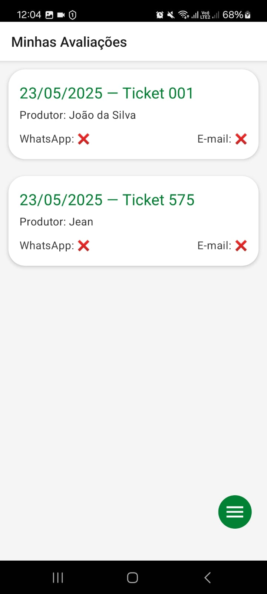
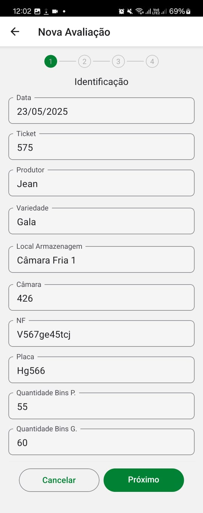
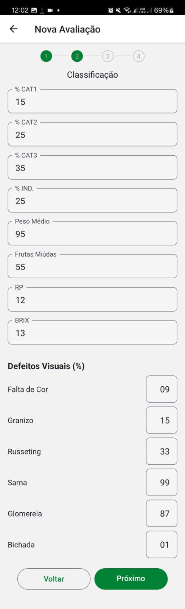
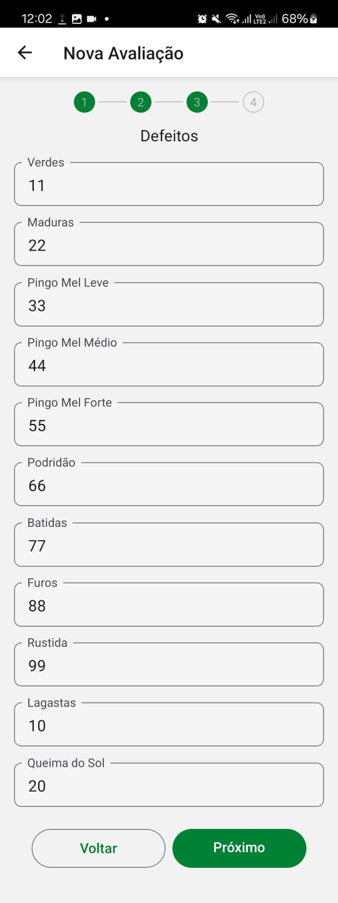
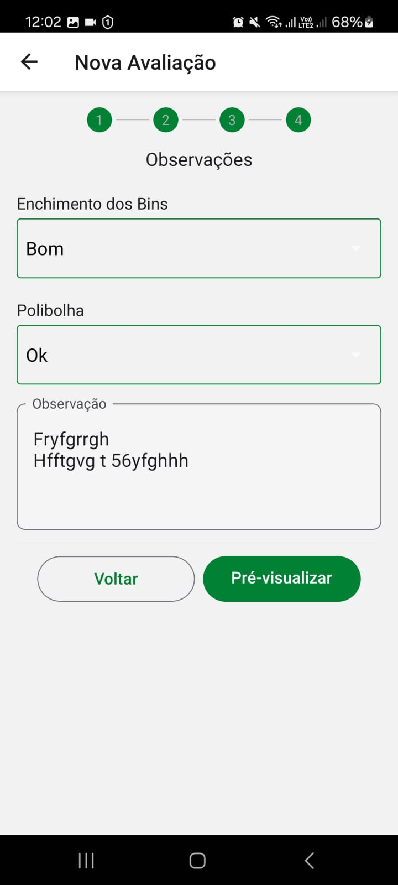
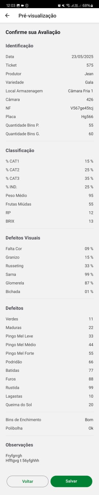

# AvaliaçãoCastelApp

> App Android — registro e gestão de avaliações de frutas (offline-first)  
> Feito em React Native + TypeScript. Ideal para uso em campo (pomares / câmaras) com sincronização eventual.

---

## 🚀 Visão Geral

**AvaliaçãoCastelApp** é uma aplicação móvel desenvolvida para equipes de campo registrarem avaliações de qualidade de frutas de forma rápida, confiável e offline. O app foi pensado para operações agrícolas e de logística que precisam coletar muitos dados no ponto de origem e, quando possível, sincronizar posteriormente.

Principais preocupações do projeto: **usabilidade em telas pequenas**, **resiliência offline**, **fluxos rápidos de cadastro (wizard)** e **exportação / compartilhamento** para integração com relatórios e comunicação com clientes (e-mail / WhatsApp).

---

## ✨ Funcionalidades Principais

- **Autenticação** via Firebase (e-mail/senha) com fluxo offline-first.
- **Cadastro de Avaliações** em um wizard multi-etapas (Identificação → Classificação → Defeitos → Observações).
- **Validações embarcadas** (por exemplo: `%CAT1 + %CAT2 + %CAT3 + %IND` = 100%).
- **Autocomplete** para produtores, variedades e locais.
- **Gerenciamento de master data** (produtores, variedades e locais) via telas dedicadas.
- **Preview / Confirmação** de avaliação antes do salvamento.
- **Envio por WhatsApp** (formato rico) com confirmação do envio.
- **Exportação XLSX** (SheetJS) e envio por e-mail com anexo.
- **Flags de envio**: `enviadoWhatsapp` e `enviadoEmail`.
- **UI/UX**: tema da empresa, fluxo com indicadores de progresso e acessibilidade melhorada.
- **Persistência local** para uso offline; sincronização eventual com Firebase como opção futura.

---

## 🧭 Fluxo do Usuário (resumido)

1. Login (offline-friendly).
2. Lista de avaliações (com filtros por data / produtor / ticket).
3. Criar nova avaliação (wizard de múltiplos passos).
4. Revisar em `Preview` e escolher: salvar, enviar WhatsApp, enviar e-mail.
5. Exportar lote de avaliações visíveis em XLSX e anexar por e-mail.

---

## 🛠️ Tecnologias & Dependências

- **Linguagem:** TypeScript  
- **Framework:** React Native (CLI)  
- **Navegação:** React Navigation (Native Stack)  
- **UI:** React Native Paper (Theming)  
- **Banco local:** react-native-sqlite-storage (SQLite) — utilizado internamente pelo app  
- **Date picker:** @react-native-community/datetimepicker  
- **Select:** @react-native-picker/picker  
- **Excel:** xlsx (SheetJS)  
- **Arquivos:** react-native-fs  
- **Email:** react-native-mail  
- **Compartilhamento WhatsApp:** Linking / deep link  
- **Autenticação:** Firebase Auth  
- **Context API:** SnackbarProvider para mensagens globais

---

## ✅ Boas Práticas adotadas no projeto

- **Offline-first**: dados essenciais persistidos localmente, com sincronização opcional.
- **Componentização**: inputs, listas e menus isolados para reutilização e manutenção.
- **Acessibilidade e usabilidade**: auto-focus nos campos, indicadores de progresso e validações claras.
- **UX escalável**: wizard com validações etapa-a-etapa para reduzir erros na coleta.
- **Exportabilidade**: template XLSX com cabeçalhos legíveis (com acentuação) e personalizáveis.

---

## 📁 Estrutura Resumida do Projeto

```
/src
  /components       # Inputs reutilizáveis, Autocomplete, Menu, SnackProvider...
  /screens          # Login, ListaAvaliacoes, CadastroAvaliacao, Confirm, Preview, MasterData
  /services         # dbService (SQLite), export (XLSX), mail/whatsapp helpers
  /context          # SnackbarProvider, AuthContext
  /utils            # helper (formatDateBR), labelsEnum, templates (whatsapp/xlsx)
  /database         # scripts de criação / seed (executados internamente)
```

---

## 📸 Screenshots / Fluxos

> (Substitua pelos assets do projeto)

1. Lista com filtros e status (WhatsApp / Email)




2. Wizard de cadastro em 4 passos







3. Preview




---

## 📋 Testes, Qualidade e Entrega

- **Linting & TypeScript** ativados para reduzir regressões.
- **Mensagens de feedback** consistentes via `SnackbarProvider`.
- **Entrega ao cliente** costuma incluir:
  - Pacote de instalação (APK/AAB) para distribuição
  - README resumido e instruções administrativas
  - Documentação não técnica sobre uso e fluxo
  - DDL / esquema de dados e scripts de seed (para importação inicial)
  - Contato para suporte e treinamento (se contratado)

---

## 🤝 Como colaborar / solicitar alterações

Se desejar evoluções (ex.: sincronização automática com backend, relatórios adicionais, integração com ERP), abra uma solicitação descrevendo o requisito e impacto esperado. Trabalhos de evolução são estimados em esforço e custo.

---

## 👤 Contato & Suporte

**Dev Lead:** Patrick Cremonese  
✉️ contato@patrickcremonese.com.br

